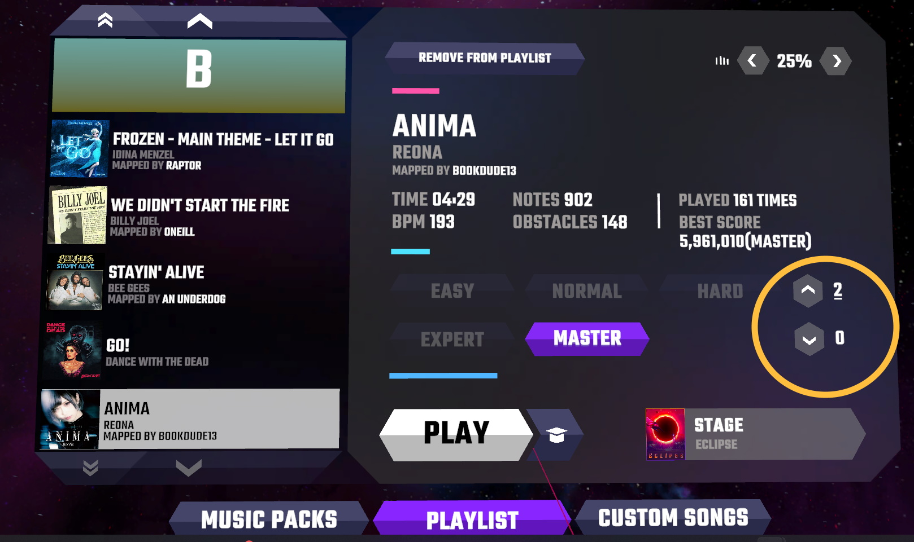

# SRVoting
A Synth Riders mod for in-game up/down vote of custom songs hosted on [Synthriderz](https://synthriderz.com)

## Requirements
- PCVR (Steam) version of Synth Riders. No modding support for standalone Oculus yet :/ I've tested on Oculus Quest 2 through Oculus Link, other headsets untested.
- [Synthriderz](https://synthriderz.com) account
- Steam account linked to Synthriderz account (link them [here](https://synthriderz.com/user/profile#accounts))

## Installing
1. Prepare Synth Riders for modding by following the [MelonLoader](https://melonwiki.xyz/#/README) wiki guide
2. Download the newest version of SRVoting from the Releases section. Your web browser may warn you about the .zip file because it contains a .dll - this is normal, and is how mods are built. Save the zip file.
3. Extract the contents of the .zip file to  `<path-to-synth-riders>\Mods` (create a new directory if it doesn't exist). On Windows, this will be at `C:\Program Files (x86)\Steam\steamapps\common\SynthRiders\Mods`
4. Run Synth Riders and enjoy!

## Voting
Select any custom song within the game, from Solo, Party or Multiplayer song selection. The voting arrows and the number of up/down votes for the song appear next to the difficulties. If the number is underlined, that is your vote. If no vote is underlined, you have not voted yet.

If you vote for the same direction you already voted, then it removes your vote. For example, if you upvote a song that has 39 upvotes and 2 downvotes, it will now have 40 upvotes and 2 downvotes. If you hit the upvote arrow again, the song goes back to 39 upvotes but stays at 2 downvotes. Of course, you can also directly go between up and down votes :)

## Frequently Asked Questions
>I don't see the new voting UI. Where is it?

The up/down vote arrows will not appear in the following conditions:
- The song is a part of the OST. Only custom songs can receive votes.
- There is no internet connection. Vote data is retrieved from Synthriderz, so an active internet connection is needed for voting. Right now the UI elements are hidden if any error like this occurs.
- There is an error communicating with Synthriderz. Sometimes the site is down; be patient and try again later.
- Your Steam account is not linked to Synthriderz. Steam is used to authenticate and avoid double-voting. Follow the steps under Requirements to link your accounts.
- The song is not present on Synthriderz. This usually happens for WIP maps that haven't been uploaded as drafts yet. Draft maps _can_ receive votes.

## Development
Feel free to extend this as you want. Open issues for bugs and feature requests, and open PRs if you implement some of those yourself. I will try to respond in a timely manner :)

## Issues
If issues arise, add an Issue to this repository or ping me on Discord.

---

### Disclaimer
This mod is not affiliated with Synth Riders or Kluge Interactive. Use at your own risk.
